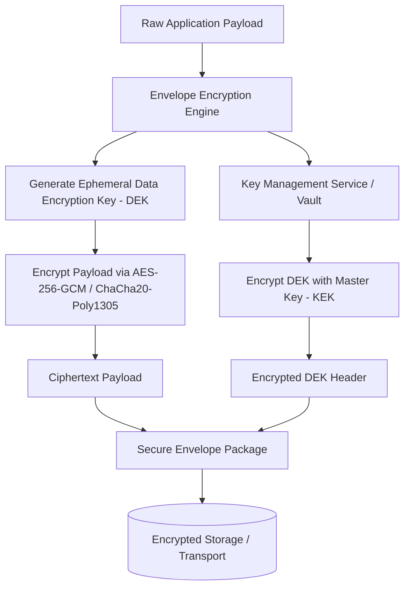

# 🔐 Enterprise Encryption & Data Security Suite
> **Production-grade cryptographic library and key management orchestration for sensitive enterprise data-at-rest and in-transit.**

[](https://opensource.org/licenses/MIT)
[](https://www.typescriptlang.org/)
[](https://csrc.nist.gov)
[]()

---

## 🏛️ Architecture Overview

The **Enterprise Encryption & Data Security Suite** provides unified cryptographic primitives, envelope encryption pipelines, automated key rotation with Cloud KMS (AWS KMS, GCP Cloud KMS, HashiCorp Vault), and post-quantum hybrid cryptographic implementations.



---

## 🚀 Core Capabilities

* **Modern Symmetric Ciphers:** Authenticated AES-256-GCM and ChaCha20-Poly1305 with automatic nonce randomization and tag verification.
* **Envelope Encryption (DEK/KEK):** High-speed local data encryption with remote centralized key wrapping.
* **Asymmetric & Hybrid Exchange:** RSA-4096 and Elliptic Curve Diffie-Hellman (ECDH over X25519) with Kyber-768 post-quantum hybrid support.
* **Zero-Knowledge Field-Level Encryption:** Field masking, tokenization, and deterministic searchable encryption for compliance (GDPR, HIPAA, PCI-DSS).
* **Automated Key Lifecycle & Rotation:** Scheduled key retirement, cryptographic shredding, and version tracking.

---

## 📦 Quick Start

### Installation
```bash
npm install @harinish/encryption-data-security
# or
pnpm add @harinish/encryption-data-security
```

### Basic Envelope Encryption Example
```typescript
import { EnvelopeEncryptor, VaultKMSProvider } from '@harinish/encryption-data-security';

const kms = new VaultKMSProvider({
  endpoint: process.env.VAULT_ADDR,
  token: process.env.VAULT_TOKEN,
  keyName: 'enterprise-app-master'
});

const encryptor = new EnvelopeEncryptor({
  kmsProvider: kms,
  algorithm: 'AES-256-GCM'
});

// Encrypt payload
const encryptedPackage = await encryptor.encrypt(
  Buffer.from(JSON.stringify({ ssn: '000-12-3456', balance: 50000 }))
);

// Decrypt payload
const decrypted = await encryptor.decrypt(encryptedPackage);
console.log('Decrypted:', decrypted.toString('utf8'));
```

---

## 🤖 Vibe Coding & Autonomous AI Development
This repository is pre-configured for autonomous AI agents and vibe-coding tools (Cursor, Claude, Copilot, Antigravity):
* [`PRD.md`](./PRD.md) — Comprehensive functional specifications and architecture bounds.
* [`ROADMAP.md`](./ROADMAP.md) — Prioritized feature milestones.
* [`TODO.md`](./TODO.md) — Atomic implementation checklist with unit test acceptance criteria.
* [`AGENTS.md`](./AGENTS.md) — Architectural rules and invariants for AI code generation.

---

## 🛡️ Security & Compliance
* All cryptographic operations use constant-time comparisons (`crypto.timingSafeEqual`) to prevent timing side-channel attacks.
* Plaintext buffers in memory are wiped immediately post-operation with zeroization routines.
* Report security vulnerabilities responsibly via GitHub Security Advisories.

## 📄 License
This project is licensed under the **MIT License** - see the [LICENSE](LICENSE) file for details.
